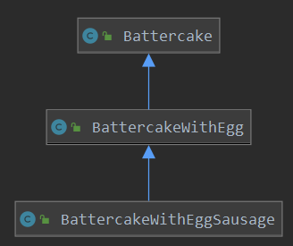

> 慕课网课程《 [Java设计模式精讲](https://coding.imooc.com/class/270.html) 》笔记

# Java设计模式精讲
**创建型**： 单例 抽象工厂 原型 建造者 工厂

**结构型**： 适配器 桥接 装饰 组合 外观 享元 代理

**行为型**： 模板 命令 访问者 迭代器 观察者 中介者 备忘录 解释器（Interpreter） 状态 策略 职责链（责任链）
## 一、6大设计原则

### 1、开闭原则

**定义**： 一个软件实体，模块和函数应该对扩展开放，对修改关闭。

**核心思想**： 用抽象构建框架，用实现扩展细节

**优点**： 提高软件系统的可复用性及可维护性


### 2、依赖倒置原则

**定义**：高层模块不应该依赖底层模块，二者都应该依赖其抽象

抽象不应该依赖细节，细节应该依赖抽象

针对接口编程，不要针对实现编程

**优点**：可以减少类间的耦合性，提高系统稳定性，提高代码的可读性和可维护性，可降低修改程序所造成的的风险


### 3、单一职责原则

**定义**：不要存在多于一个导致类变更的原因

一个类、接口、方法只负责一项职责

**优点**：降低类的复杂度、提高类的可读性、提高系统的可维护性、降低变更引起的风险


### 4、接口隔离原则

**定义**：用多个专门的接口，而不使用单一的总接口，客户端不应该依赖他不需要的接口。一个类对一个类的依赖应该建立在最小的接口上，建立单一接口，不需要建立
庞大臃肿的接口，尽量细化接口，接口中的方法应该适度少量。

**注意**：一定要适度

**优点**： 符合我们常说的高内聚低耦合的设计思想，从而使得类具有很好的可读性，可扩展性和可维护性


### 5、迪米特原则

**定义**：一个对象应该对其他的对象保持最少的了解，又叫最少知道原则。

尽量降低类与类之间的耦合

**优点**：降低类之间的耦合

强调只和朋友交流，不和陌生人说话

`朋友：`出现在成员变量，方法的输入，输出参数中的类称为成员朋友类，而出现在方法体内部的类不属于朋友类。


### 6、里氏替换原则

 “派生类（子类）对象可以在程序中代替其基类（超类）对象。”

## 二、设计模式

### 创建型

#### 1、简单工厂模式（也可不算）


#### 2、工厂方法模式 *

针对的是产品等级

**定义**：

定义一个创建对象的接口，但让实现这个接口的类来决定实例化哪个类

工厂方法让类的实例化推迟到子类中进行

**适用场景**：

创建对象需要大量重复代码

客户端不依赖于产品实例如何被创建，实现等细节

一个类通过其子类来指定创建哪个对象

**优点**：

用户只需要关心所需产品对应的工厂，无需关心创建细节

加入新产品符合开闭和原则，提高可扩展性

**缺点**：

类的个数容易过多，增加复杂度

增加了系统的抽象性和理解难度


#### 3、抽象工厂模式 *

针对的是产品族

**定义**：抽象工厂模式提供一个创建一系列相关或相互依赖对象的接口，无需指定他们的类

**适用场景**：

客户端不依赖于产品类实例如何被创建，实现等细节。

强调一系列相关的产品对象（属于同一产品族）一起使用创建对象需要大量重复的代码

提供一个产品类的库，所有的产品以同样的接口出现，从而使客户端不依赖于具体的实现

**优点**：

具体产品在应用层代码隔离，无需关心创建细节。

将一个系列的产品族统一到一起创建。

**缺点**：

规定了所有可能被创建的产品集合，产品族中扩展新的产品困难，需要修改抽象工厂接口

增加了系统的抽象度和理解难度


#### 4、建造者模式 *

普通式

建造者V2升级版（链式调用）

**定义**：讲一个复杂对象的构建与它的表示分离，市的同样的构建过程可以创建不同的表示 ，用户只需要指定需要构建的类型就可以得到它们，建造过程及细节不要知道

**适用场景**：

如果一个对象有非常复杂的内部结构（很多属性）

想法复杂对象的创建和使用分离

**优点**：

封装性好，创建和使用分离

扩展性好，建造类之间独立，一点程度上解耦

**缺点**：

产生多余的builder对象

产品内部发生变化，建造者都要修改，成本较大

`建造者和工厂模式的区别：`

建造者更注重创建产品的顺序，当对象内部复杂时适合使用

工厂注重于创建产品，当创建简单产品时适合使用

`创建者`


`建造者V2升级版`


#### 5、单例模式 *

懒汉式

饿汉式

枚举式

线程式

**定义**：保证一个类仅有一个实例，并提供一个全局的访问点

**适用场景**：想确保任何情况下都绝对只有一个实例

**优点**：

在内存里只有一个实例，减少了内存开销

可以避免对资源的多重占用

设置全局访问点，严格控制访问

**缺点**：没有接口，扩展困难

`重点：`

私有构造器

线程安全

延迟加载

序列化和反序列化安全

反射

`实用技能：`

反编译

内存原理

多线程debug

#### 6、原型模式

**定义**：原型实例指定创建的对象的实例，并通过拷贝这些原型创建新的对象，不需要知道任何的创建细节，不调用构造函数。

**适用场景**：

类初始化消耗较多资源

new产生一个对象需要非常繁琐的过程（数据准备，访问权限等）

构造函数比较复杂

循环体中生产大量对象时

**优点**：

原型模式性能比直接new一个对象性能要高

简化创建过程

**缺点**：

必须配备克隆方法

对克隆复杂对象和克隆出的对象进行复杂改造时，容易引入风险

深拷贝，浅拷贝要运用得当

`扩展`深克隆，浅克隆

### 结构型

#### 1、外观模式=门面模式

**定义**：又叫门面模式，提供了一个统一的接口，用来访问子系统中的一群接口。外观模式定义了一个高层接口，让子系统更容易使用。

**适用场景**：

子系统越来越复杂，增加外观模式提供简单调用接口

构建多层系统结构，利用外观对象作为每层的入口，简化层间调用

**优点**：

简化了调用过程，无需深入了解子系统，防止带来风险

减少系统依赖，松散耦合

更好的划分访问层次

符合迪米特法则，即最少知道原则

**缺点**：

增加子系统，扩展子系统时容易引入风险

不符合开闭原则

**相关设计模式**：

中介者模式（外观模式外界和子系统、中介者：子系统内部之间的交互）单例模式（外观对象做成单例）抽象工厂模式 （外观类可通过抽象工厂获取子系统实例）


应用层只和外观类交互

源码应用：org.springframework.jdbc.support.JdbcUtils对原生jdbc封装

org.apache.ibatis.session.Configuration#newMetaObject

#### 2、装饰者模式

**定义与类型**：

**定义**：在不改变原有对象的基础之上，将功能附加到对象上

提供了比继承更有弹性的替代方案(扩展原有对象功能)

**适用场景**：

扩展一个类的功能或给一个类添加附加职责

动态的给一个对象添加功能，这些功能可以再**动态**的撤销

**优点**：

继承的有力补充，比继承灵活，不改变原有对象的情况下给一个对象扩展功能.

通过使用不同装饰类以及这些装饰类的排列组合，可以实现不同效果

符合开闭原则

**缺点**：

会出现更多的代码，更多的类，增加程序复杂性

动态装饰时，多层装饰时会更复杂

**相关设计模式**：

装饰者模式（动态添加方法）和代理模式（控制对对象的访问）

装饰者模式和适配器模式（都可叫包装模式wrapper）

v1版本



v2版本


```java

public static void main(String[] args) {
    AbstractBatterCake aBatterCake;

    aBatterCake = new BatterCake();

    aBatterCake = new EggDecorator(aBatterCake);

    aBatterCake = new EggDecorator(aBatterCake);

    aBatterCake = new SausageDecorator(aBatterCake);

    System.out.println(aBatterCake.getDesc() + " 销售价格：" + aBatterCake.cost());
}
```

#### 3、适配器模式 *

类适配器模式

对象适配器模式

**定义**：将一个类的接口转换成客户期望的另一个接口，使原本接口不兼容的类可以一起工作

**适用场景**：

已经存在的类，它的方法和需求不匹配时（方法结果相同或者相似）

不是软件设计阶段考虑的设计模式，是随着软件维护，由于不同产品，不同厂家造成功能类似而接口不相同的情况下的解决方案

**优点**：

能提高类的透明度和复用，现有的类复用单不需要改变

目标类和适配器类解耦，提高程序扩展性

符合开闭原则

**缺点**：

适配器编写过程需要全面考虑，可能会增加系统的复杂度

增加系统代码的刻度难度

`扩展：`

对象适配器（委托机制）

类适配器（类继承）

**相关设计模式**：

适配器模式和外观模式

都是对现有的类现存系统的封装，外观定义了一个新的接口，提供更为方便的访问入口。适配器是复用一个原有的接口，使已有的两个接口协同工作

类适配器模式UML（adapter继承adaptee）


对象适配器模式UML （组合）


源码：

javax.xml.bind.annotation.adapters.XmlAdapter

org.springframework.aop.framework.adapter.AdvisorAdapter

org.springframework.orm.jpa.JpaVendorAdapter

org.springframework.web.servlet.HandlerAdapter

org.springframework.web.servlet.mvc.SimpleControllerHandlerAdapter

#### 4、享元模式

**定义**：提供了减少对象数量从而改善应用所需的对象结构的方式。运用共享技术有效的支持大量的细粒度的对象

**适用场景**：

常常应用于系统底层的开发，以便解决系统的性能问题

系统有大量相似对象，需要缓存池的场景

**优点**：

减少对象的创建，降低内存中对象的数量，降低系统的内存，提高效率

减少内存之外的其他资源的占用

**缺点**：

关注内外部状态，关注线程安全问题

使系统，程序逻辑复杂化（外部状态、内部状态）

`扩展：`

内部状态：记录在享元对象内部，不会随着环境改变而改变，共享状态（大白话：享元对象的属性）

外部状态：记录在享元对象外部，随着环境改变而改变，不可共享状态

**相关设计模式**：

单例模式（容器单例）代理模式（如果生成代理类花费资源和时间比较多，可用享元模式提交速度）


java.lang.Integer#valueOf(int)

#### 5、组合模式

**定义**：将对象组合成树形结构以表示“部分-整体”的层次结构

`作用：`组合模式是客户端对单个对象和组合对象保持一致的方式处理

**适用场景**：

希望客户端可以忽略组合对象与单个对象的差异时

处理一个树形结构时

**优点**：

清楚的定义分层次的复杂对象，表示对象的全部或者部分层次

让客户端忽略了层次的差异，方便对整个层次结构进行控制

简化客户端代码

符合开闭原则

**缺点**：

限制类型时会较为复杂

使设计变得更加抽象

**相关设计模式**：

访问者模式


#### 6、桥接模式

**定义**：

将抽象部分与它的具体实现部分分离，使他们都可以独立的变化

通过组合的方式建立两个类之间的联系，而不是继承

**适用场景**：

抽象和具体实现之间增加更多的灵活性

一个类存在两个或者多个独立变化的维度，且这两个或者多个独立的维度都需要独立的扩展

不希望使用继承，或因为多层继承导致系统类的个数剧增

**优点**：

分离抽象部分及其具体实现部分

提高了系统的可扩展性

符合开闭原则

符合合成复用原则

**缺点**：

增加了系统的理解与设计难度

需要准确的识别出系统中两个独立变化的维度

**相关设计模式**：

桥接模式：注重平行级别的组合，分离抽象和具体实现，然后再重新组合，目的是分离

组合模式：注重不同级别的组合

适配器模式：可以把功能上相似，但是接口不同的类适配起来


#### 7、代理模式 *

静态代理模式(结构型)

动态代理模式(结构型)

**定义**：

为其他对象提供一种代理，以控制对这个对象的访问

代理对象在客户端对象和目标对象之间起到中介的作用

**适用场景**：

保护目标对象（如租房时可能连房东的面都没见过）

增强目标对象（如草拟合同、收水电费）

**优点**：

代理对象能将代理对象与真是被调用的目标对象分离

一定程度上降低了系统的耦合度，扩展性好

保护目标对象

增强目标对象（如before、after）

**缺点**：

代理模式会造成系统设计中类的数目的增加

在客户端和目标对象增加一个代理对象，会造成请求处理速度变慢

增加系统复杂度

`扩展：`

静态代理（显式在代码中定义一个业务实现类的代理）

动态代理（JDK中动态代理只能对实现了接口的类生成代理，程序调用到代理类对象时才由jvm真正创建）

CGLib动态代理（可以代理类，针对类实现进行代理，生成被代理类的子类：通过继承重写业务方法，需关注final修饰符，因无法继承重写）

`spring 代理选择扩展`

当Bean有实现接口时， spring就会用JDK的动态代理

当Bean没有实现接口时，spring使用CGLib

可以强制使用CGLib，在spring配置中加入<aop:aspectj-autoproxy proxy-target-class="true"/>

参考资料： https://docs.spring.io/spring/docs/current/spring-framework-reference/core.html

`代理速度对比`

在万次运行下 jdk7以上的动态代理要比CGLib快大约20%

**相关设计模式**：

装饰者模式：为对象添加行为；而代理模式是控制访问，增强目标对象

适配器模式：改变所考虑对象的接口

静态代理UML


动态代理UML


java.lang.reflect.Proxy

org.springframework.aop.framework.ProxyFactoryBean

org.springframework.aop.framework.JdkDynamicAopProxy

org.springframework.aop.framework.CglibAopProxy

org.apache.ibatis.binding.MapperProxyFactory#newInstance(org.apache.ibatis.session.SqlSession)


### 行为型

#### 1、模板方法模式 *

**定义**：

定义了一个算法骨架，并允许子类为一个或者多个步骤提供实现

模板方法使得子类可以在不改变算法结构的情况下，重新定义算法的某些步骤

**适用场景**：

一次性实现一个算法的不变的部分，并将可变的行为留给子类来实现

各子类中公共的行为被提取出来并集中到一个公共的父类中，从而避免代码重复

**优点**：

提高复用性

提高扩展性

符合开闭原则

**缺点**：

类数目增加

增加了系统实现的复杂度

继承关系自身缺点，如果父类添加新的抽象方法，所有的子类都要改一遍

`扩展：`钩子方法

**相关设计模式**：

工厂方法：工厂方法是模板方法的一种特殊实现

策略模式：都有封装算法，不同的算法可以相互替换，并且不影响客户端应用层的使用，可以改变算法流程（一般在if...else...的情况下考虑使用）

模板方法：定义一个算法的流程，将一些不太一样的实现步骤交给子类区实现，整体不改变算法流程


java.util.AbstractList

java.util.AbstractMap

java.util.AbstractSet

javax.servlet.http.HttpServlet

org.apache.ibatis.executor.BaseExecutor

#### 2、迭代器模式（少用）

**定义**：提供一 种方法，顺序访问一个集合对象中的各个元素，而又不暴露该对象的内部表示

**适用场景**：

访问一个集合对象的内容而无需暴露它的内部表示

为遍历不同的集合结构提供一个统一的接口

**优点**：

分离了集合对象的遍历行为

**缺点**：

类的个数成对增加（新增一个集合类，新增一个迭代器）

**相关设计模式**：

迭代器模式（扩展开放的部分在集合对象的种类）和访问者模式（扩展开放的部分在对象的操作）

java.util.Iterator

java.util.ArrayList.Itr

org.apache.ibatis.cursor.defaults.DefaultCursor

#### 3、策略模式 *

**定义**：定义了算法家族，分别封装起来，让它们之间可以互相替换，此模式让算法的变化不会影响到使用算法的用户。

if...else....

**适用场景**：

系统有很多类，而他们的区别仅仅在于他们的行为不同

一个系统需要动态地在几种算法中选择一种

**优点**：

开闭原则

避免使用多重条件转移语句

提高算法的保密性和安全性

**缺点**：

- 客户端必须知道所有的策略类，并自行决定使用哪一个策略类。

- 产生很多策略类

**相关设计模式**：

- 策略模式和工厂模式

- 策略模式（行为存在多种实现方式）和状态模式（不同状态不同行为，状态可以发生转换）


java.util.Comparator

org.springframework.core.io.Resource

org.springframework.beans.factory.support.InstantiationStrategy

#### 4、解释器模式（少用）

**定义**：

定义：给定一个语言，定义它的文法的一种表示，并定义一个解释器，这个解释器使用该表示来解释语言中的句子。

为了解释一种语言，而为语言创建的解释器

**适用场景**：

某个特定类型问题发生频率足够高

**优点**：

语法由很多类表示，容易改变及扩展此"语言"

**缺点**：

当语法规则数目太多时，增加了系统复杂度

**相关设计模式**：

解释器模式和适配器模式（不需要提前知道适配的规则）


java.util.regex.Pattern

org.springframework.expression.spel.standard.SpelExpressionParser

#### 5、观察者模式 *

**定义**：定义了对象之间的一对多依赖，让多个观察者对象同时监听某一个主题对象，当主题对象发生变化时，它的所有依赖者(观察者)
都会收到通知并更新（如降价通知）

**使用场景**：

关联行为场景，建立一套触发机制

**优点**：

观察者和被观察者之间建立一个抽象的耦合

观察者模式支持广播通信

**缺点**：

观察者之间有过多的细节依赖、提高时间消耗及程序复杂度

使用要得当，要避免循环调用


java.util.EventListener

com.google.common.eventbus.EventBus

#### 6、备忘录模式（少用）

**定义**：保存一个对象的某个状态，以便在适当的时候恢复对象。

"后悔药"

**适用场景**

保存及恢复数据相关业务场景

后悔的时候，即想恢复到之前的状态

**优点**：

为用户提供一种可恢复机制

存档信息的封装

**缺点**：

资源占用

**相关设计模式**：

备忘录模式（实例表示状态）和状态模式（类表示状态）


#### 7、命令模式

**定义**：将"请求"封装成对象，以便使用不同的请求

命令模式解决了应用程序中对象的职责以及它们之间的通信方式

**适用场景**：

请求调用者和请求接收者需要解耦，使得调用者和接收者不直接交互

需要抽象出等待执行的行为

**优点**：

降低耦合

容易扩展新命令或者一组命令

**缺点**：

命令的无限扩展会增加类的数量，提高系统实现复杂度

**相关设计模式**

命令模式和备忘录模式


实现java.lang.Runnable的类都可认为是具体的命令实现

#### 8、中介者模式（少用）

定义一个封装一组对象如何交互的对象

通过使对象明确地相互引用来促进松散耦合，并允许独立地改变它们的交互

**适用场景**：

系统中对象之间存在复杂的引用关系，产生的相互依赖关系结构混乱且难以理解

交互的公共行为，如果需要改变行为则可以增加新的中介者类

（想成聊天室）

**优点**：

将一对多转化成了一对一、降低程序复杂度

类之间解耦

**缺点**：

中介者过多，导致系统复杂

**相关设计模式**：

中介者模式和观察者模式

观察者模式实现中介者模式中的角色通信

java.util.Timer中介者，协调各种TimerTask

#### 9、责任链模式 *

**定义**：

为请求创建一个接收此次请求对象的链

**使用场景**：

一个请求的处理需要多个对象当中的一个或几个协作处理

**优点**：

请求的发送者和接收者(请求的处理)解耦

责任链可以动态组合

**缺点**：

责任链太长或者处理时间过长，影响性能

责任链有可能过多

**相关设计模式**：

状态模式（责任链模式并不指定下一个处理对象，状态模式知道自己下一个处理对象）


javax.servlet.Filter#doFilter

ch.qos.logback.classic.selector.servlet.LoggerContextFilter#doFilter

#### 10、访问者模式（少用）

封装作用于某数据结构(如List/Set/Map等)中的各元素的操作

可以在不改变各元素的类的前提下，定义作用于这些元素的操作

**适用场景**：

一个数据结构如(List/Set/Map等)包含很多类型对象

数据结构与数据操作分离

**优点**：

增加新的操作很容易，即增加一个新的访问者

**缺点**：

增加新的数据结构困难

具体元素变更比较麻烦

访问者模式和迭代器模式


java.nio.file.FileVisitor

org.springframework.beans.factory.config.BeanDefinitionVisitor

#### 11、状态模式

允许一个对象在其内部状态改变时，改变它的行为

**适用场景**：

一个对象存在多个状态(不同状态下行为不同) ，且状态可相互转换

**优点**：

将不同的状态隔离

把各种状态的转换逻辑，分布到State的子类中，减少相互间依赖

增加新的状态非常简单

**缺点**：

状态多的业务场景导致类数目增加，系统变复杂

**相关设计模式**：

状态模式和享元模式


